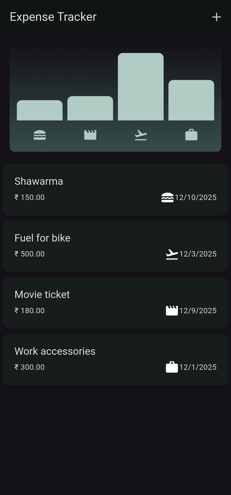
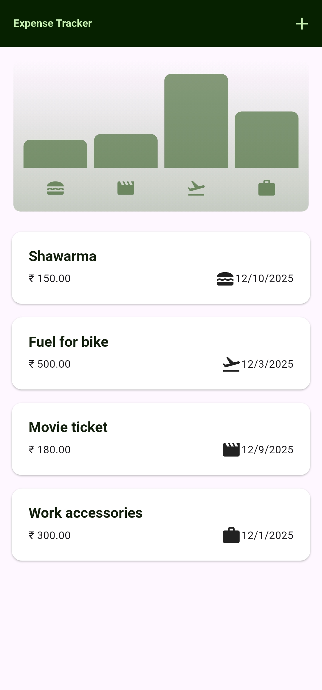
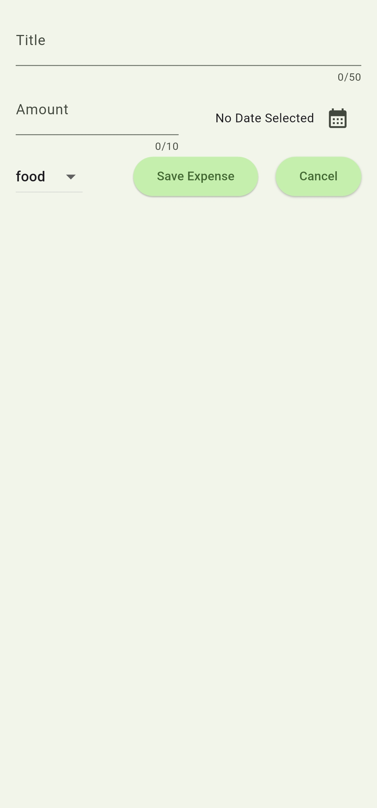
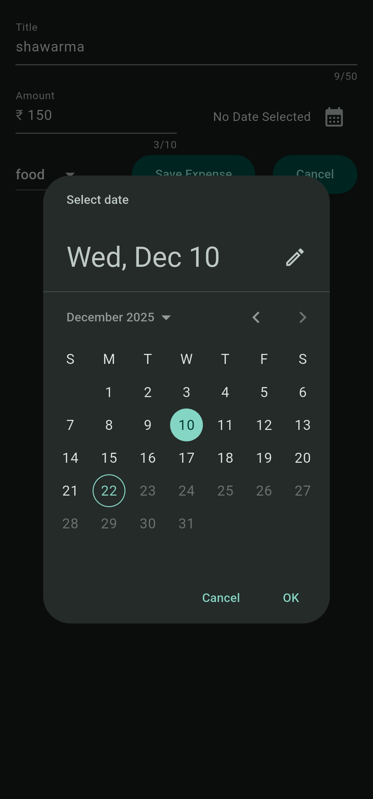
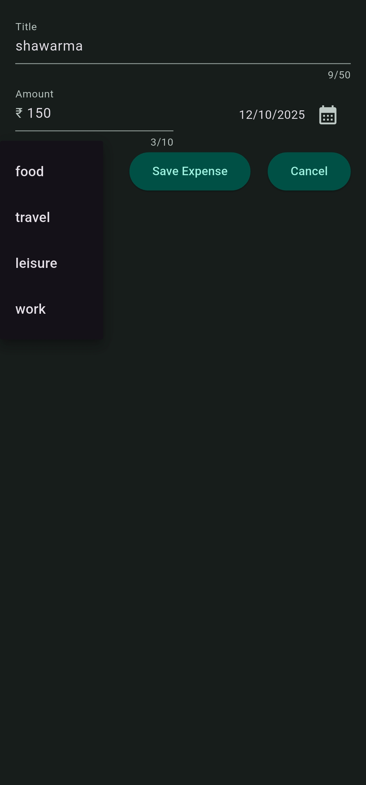
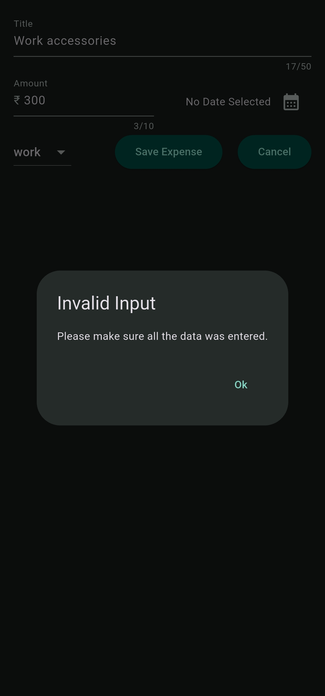
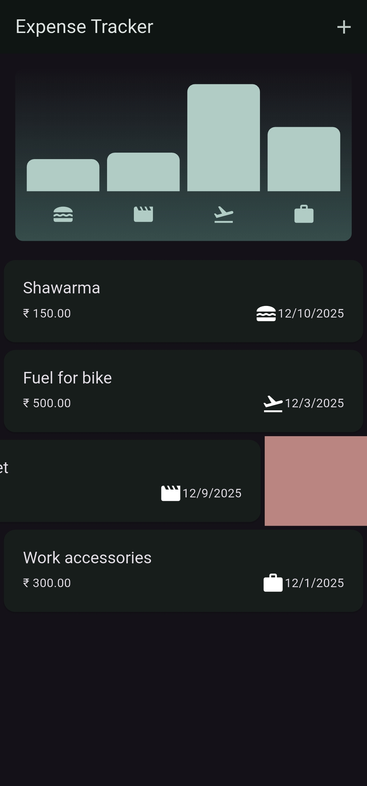
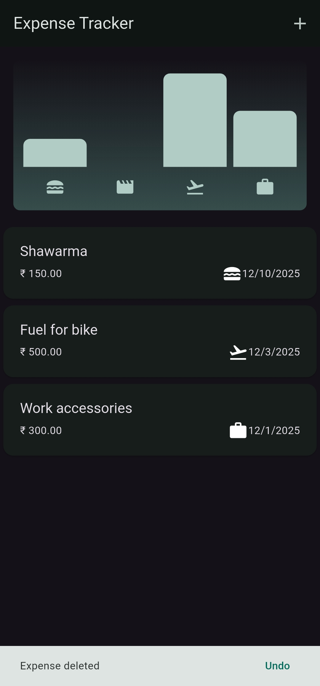

# Expense Tracker

```text
  ______                                  _______                 _
 |  ____|                                |__   __|               | |
 | |__  __  ___ __   ___ _ __  ___  ___     | |_ __ __ _  ___| | _____ _ __
 |  __| \ \/ / '_ \ / _ \ '_ \/ __|/ _ \    | | '__/ _` |/ __| |/ / _ \ '__|
 | |____ >  <| |_) |  __/ | | \__ \  __/    | | | | (_| | (__|   <  __/ |
 |______/_/\_\ .__/ \___|_| |_|___/\___|    |_|_|  \__,_|\___|_|\_\___|_|
             | |
             |_|
```             
A modern, user-friendly Expense Tracker application built with **Flutter** to help you manage your personal finances. Keep track of your daily income and expenses, visualize your spending habits with charts, and stay on top of your budget.

## Features

* **Transaction Logging**: Easily add new expenses with a title, amount, date, and category.
* **Spending Chart**: Visualize your expenses.
* **Category Management**: Organize your spending into predefined categories (e.g., food, travel, leisure, work).
* **Date Selection**: Pick specific dates for your transactions using a built-in date picker.
* **Delete Transactions**: Remove incorrect or old entries with a simple swipe action.
* **Responsive UI**: Designed to look great on both Android .

## Screenshots

Here is a glimpse of the application in action:

| **Dashboard & Chart (Dark)** | **Dashboard & Chart (Light)** | **Add Expense (Light)** |
|:---:|:---:|:---:|
|  |  | |

| **Date Selection (Dark)** | **Category Selection Dropdown (Dark)** | **Invalid Entry (Dark)** |
|:---:|:---:|:---:|
|  |  | |

| **Delete Expense (Dark)** | **Undo Delete (Dark)** |
|:---:|:---:|
|  |  |

## Tech Stack

* **Framework**: [Flutter](https://flutter.dev/)
* **Language**: [Dart](https://dart.dev/)
* **Date Formatting**: [Intl](https://pub.dev/packages/intl)

## Getting Started

Follow these instructions to get a copy of the project up and running on your local machine.

### Prerequisites

* [Flutter SDK](https://flutter.dev/docs/get-started/install) installed.
* A physical device or emulator (Android/iOS).

### Installation

1.  **Clone the repository:**
    ```bash
    git clone [https://github.com/Advaith-dev/expense_tracker.git](https://github.com/Advaith-dev/expense_tracker.git)
    ```

2.  **Navigate to the project directory:**
    ```bash
    cd expense_tracker
    ```

3.  **Install dependencies:**
    ```bash
    flutter pub get
    ```

4.  **Run the app:**
    ```bash
    flutter run
    ```

## Project Structure

The project is organized into a modular structure to separate data models, UI widgets, and application logic.

```text
lib/
├── models/
│   └── expense.dart             # Data model for Expense and Categories
├── widgets/
│   ├── chart/
│   │   ├── chart_bar.dart       # Individual bar component for the chart
│   │   └── chart.dart           # Chart widget logic and layout
│   ├── expenses_list/
│   │   ├── expense_item.dart    # Widget for a single expense list item
│   │   └── expenses_list.dart   # Widget for the list of expenses
│   ├── expenses.dart            # Main screen widget displaying chart and list
│   └── new_expense.dart         # Modal sheet widget for adding new expenses
└── main.dart                    # Application entry point and theme config